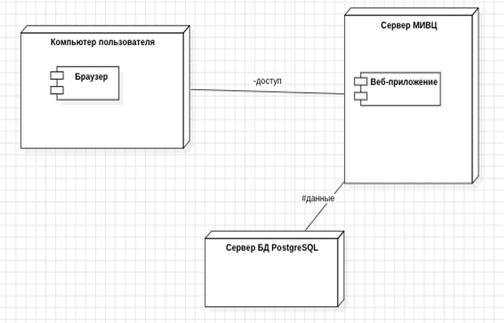

Система управления доступом, разработанная для оптимизации процесса контроля входа и выхода на объект, управления учетными записями пользователей и выдачи пропусков  
Система позволяет администраторам и пользователям эффективно управлять доступом через удобный интерфейс 

Основные задачи проекта:
- Упрощение процесса управления пользователями.
- Учет и контроль сроков действия пропусков.
- Возможность для пользователей просматривать свои пропуска

## **Функциональные возможности**

### Для пользователей:
- **Просмотр личной информации**  
  Пользователь может видеть данные своей учетной записи: имя, фамилию, роль, дату создания аккаунта и т. д.
  
- **Управление пропусками**  
  Пользователи могут видеть:
  - Тип пропуска.
  - Даты действия (начало и окончание).
  - Статус пропуска (активен/не активен).

- **Интуитивно понятный интерфейс** 
  Пользователи видят только свою информацию, что гарантирует безопасность и приватность.

### Для администраторов:
- **Управление пользователями**  
  Администраторы могут:
  - Просматривать полный список пользователей.
  - Создавать новые учетные записи.
  - Редактировать и удалять данные пользователей.

- **Управление пропусками**  
  Администраторы могут:
  - Создавать пропуска с указанием сроков действия.
  - Назначать пропуска пользователям.

- **Управление ролями**  
  Возможность изменять роли пользователей (например, назначать администратора или обычного пользователя).

- **Интерфейс администрирования**  
  Удобная административная панель с полным набором инструментов управления.

## **Диагрмма развертывания**

